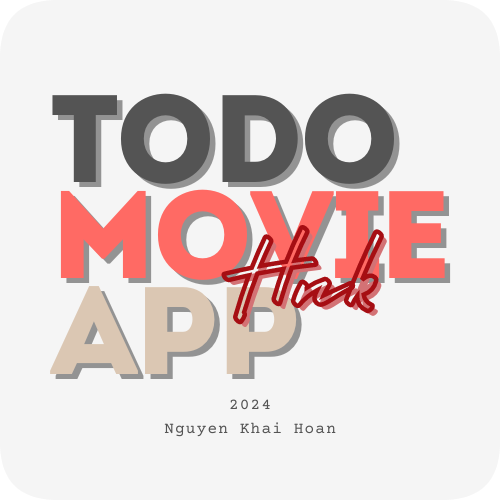

# Dự án nhỏ cá nhân về Bloc: Todo Movie App Bloc Responsive

**Mô tả:**

- Tích hợp 2 ứng dụng, lần lượt là Todo để thực hiện thêm, sửa, xóa các task với việc sử dụng thư viện Bloc, thực hiện responsive với platform web.

- Và ứng dụng Movie giúp truy cập xem các thông tin phim mới nhất thông qua API của TheMovieDB

- Ứng dụng chỉ sử dụng với mục đích học tập cá nhân và tự do sáng tạo :))

**Logo:**

     

**Hình ảnh Todo App:**

     

**Hình ảnh Movie App:**

(Đang cập nhật ...)

## Tiến trình

### Update 1: Cập nhật 14/6/2024

_Đã thực hiện:_

- [x] Thêm, sửa, xóa task
- [x] Cập nhật taskCount khi add và remove task trên drawer của Dashboard
- [x] Responsive với platform web

_Chưa thực hiện:_

- [ ] Cập nhật lại giao diện chọn list và due date trong khi thực hiện add và remove

_Demo:_

    <video controls autoplay>
        <source src="./assets/videos/Demo_Todo_Bloc_14_6.mp4" type="video/mp4">
    </video> 

## Nguồn

_Tham khảo thiết kế giao diện:_

- Design Login UI (dribble.com): [link](https://dribbble.com/shots/12216995-Schedo-Task-Manager-App)

- Design Todo App UI (uizard.io): [link](https://uizard.io/templates/website-templates/to-do-website/)

- Design Movie App UI (Đang cập nhật ...)

_API:_

- TheMovieDB (themoviedb.org): [link](https://www.themoviedb.org/?language=vi)
